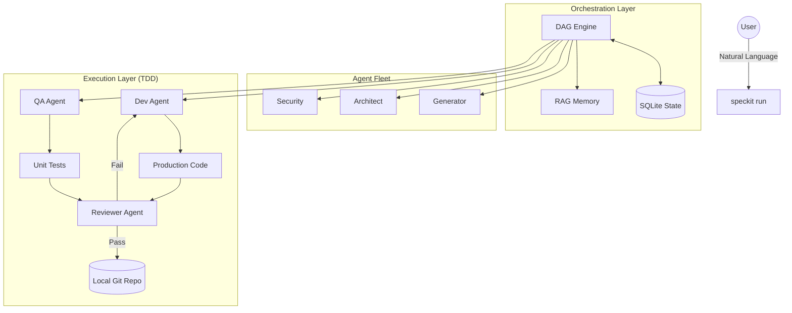

# 🌱 SpecKit: From Vibe to Verified Code

[](https://opensource.org/licenses/MIT)
[]()
[]()

**SpecKit** is a production-grade AI orchestration engine that transforms a single project idea into a complete, validated, and Git-committed repository. 

Unlike simple code generators, SpecKit uses a specialized **Multi-Agent DAG (Directed Acyclic Graph)** to design, audit, implement, and test your software autonomously.

---

## ⚡ The "Magic" Experience

Transform your vision into a repository with one command:

```bash
python speckit.py "I want a cloud-native billing system with Stripe integration and a FastAPI backend"
```

### What happens next?
1.  **Drafting**: A Generator agent creates a high-fidelity specification.
2.  **Designing**: An Architect agent builds the system design and ERDs.
3.  **Hardening**: A Security agent scans for vulnerabilities and injects zero-trust models.
4.  **Implementing**: A Dev agent writes code while a QA agent writes tests.
5.  **Verifying**: All code is tested and reviewed before being committed to Git.

---

## ✨ Key Features

- 🤖 **Autonomous Agent Fleet**: Specialized roles (Architect, Security, Dev, QA, Reviewer) collaborating in real-time.
- ⛓️ **DAG Execution Engine**: Handles complex task dependencies and parallel execution with ease.
- 🔄 **Automated TDD Loop**: Guaranteed project integrity through continuous code-test-refine cycles.
- 💾 **Stateful Memory**: Powered by SQLite & ChromaDB to learn from past project successes and failures.
- 🛡️ **Safety First**: Full `--dry-run` support with unified diff previews before any file is touched.
- ⏸️ **Human-in-the-Loop**: Pause at any milestone, review the AI's work, and sign off to continue.

---

## 🏗️ Architecture



---

## 🚀 Quickstart

### 1. Installation
```bash
git clone https://github.com/your-username/spec-kit.git
cd spec-kit
pip install -r requirements.txt
```

### 2. Configure Keys
SpecKit supports OpenAI, Claude, and Gemini via LiteLLM:
```bash
export OPENAI_API_KEY="your-key"
```

### 3. Build a Project
```bash
python speckit.py "Build a real-time chat app with WebSockets"
```

---

## 🛠️ CLI Reference

| Command | Description |
| :--- | :--- |
| `python speckit.py run "idea"` | Run the full autonomous lifecycle. |
| `python speckit.py status` | Check progress across the DAG. |
| `python speckit.py approve` | Sign off on an AI design milestone. |
| `python speckit.py dashboard` | View detailed LLM usage and graph visualization. |
| `python speckit.py --dry-run` | Preview all changes without writing to disk. |

---

## 🗺️ Roadmap
- [ ] Native VS Code extension for DAG visualization.
- [ ] Support for local LLMs (Llama 3, DeepSeek).
- [ ] Multi-repository microservices orchestration.

---

## 📄 License
Released under the [MIT License](./LICENSE).
