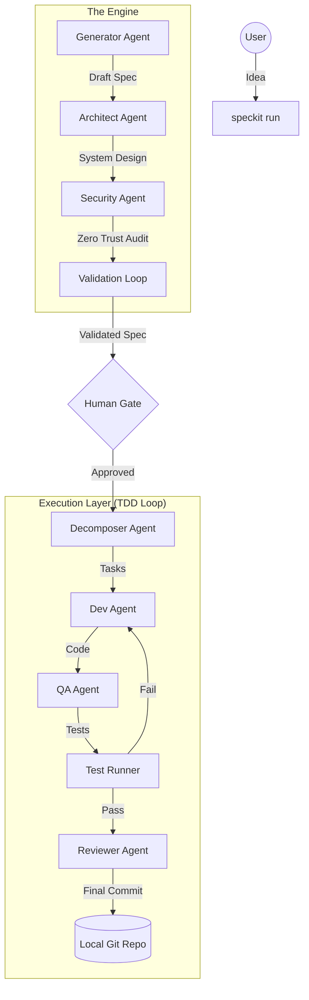

# 🌱 SpecKit

[](https://opensource.org/licenses/MIT)
[]()
[]()

**Build high-quality software from a single idea.** SpecKit is an AI-native orchestration engine that transforms natural language project descriptions into production-ready repositories with validated code, tests, and architecture.

---

## ✨ Key Features

- **Autonomous Multi-Agent Fleet**: Specialized agents for Architecture, Security, Development, QA, and Review.
- **DAG Execution Engine**: Sophisticated Directed Acyclic Graph (DAG) for parallel task execution and dependency management.
- **Automated TDD Loop**: Every line of code is accompanied by unit tests and verified by a Reviewer agent before being committed.
- **Stateful Self-Healing**: Powered by an SQLite state machine, SpecKit can pause, resume, and rollback to any node in the graph.
- **Project Memory (RAG)**: Learns from previous successful builds and architectural patterns to improve future generations.
- **Zero-Friction Interface**: A single command takes you from "vibe" to "verified code".

---

## 🏗️ How it Works

SpecKit uses a Directed Acyclic Graph (DAG) to orchestrate a team of specialized AI agents.



---

## 🚀 Quickstart

### Installation

Requires **Python 3.11+** and **Git**.

```bash
pip install speckit-engine
```

### Build your first project

Set your LLM API key (SpecKit supports OpenAI, Claude, and Gemini via LiteLLM):

```bash
export OPENAI_API_KEY="your-key-here"
```

Run the engine:

```bash
speckit run "I want a simple task tracker with a FastAPI backend and SQLite"
```

---

## 🛠️ Usage

### CLI Commands

| Command | Description |
| :--- | :--- |
| `speckit run "idea"` | Start the full autonomous lifecycle. |
| `speckit status` | View the real-time status of the DAG and agents. |
| `speckit approve` | Sign off on a design milestone to begin execution. |
| `speckit pause` / `resume` | Manage long-running build processes. |
| `speckit rollback <node>`| Revert to a previous state and retry a specific phase. |

### Safety First (Dry-Run)

Preview every file change and see the exact diffs before they are written to disk:

```bash
speckit run "my project" --dry-run
```

---

## 🧠 Project Memory & Learning

SpecKit stores every build in a local vector database. 
- **Few-shot Learning**: Future projects will automatically reference successful patterns from your past projects.
- **Pattern Avoidance**: If an architecture failed in a previous build, the Critic agent will flag it in the next one.

---

## 🗺️ Roadmap

See [ROADMAP.md](./ROADMAP.md) for our future plans, including:
- 🌐 Multi-repository orchestration.
- 🐳 Automatic Dockerization and CI/CD generation.
- 🎨 Interactive GUI for DAG management.

---

## 🤝 Contributing

We love contributions! Please see [CONTRIBUTING.md](./CONTRIBUTING.md) for guidelines.

## 📄 License

SpecKit is released under the [MIT License](./LICENSE).
